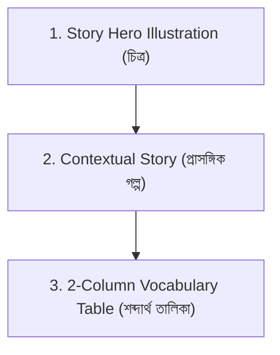

# Easy Hindi Story Vocabulary: Learn 3000+ Words Through Context — Authoring Instructions

This is the **single authoritative instruction file for Book 5**. `book.json` holds its ordered chapter plans and stable paths/IDs; `chapter-template.json` is an empty data-shape reference; `supplementary.json` holds presentation settings and UI copy.

* **Target Language:** Standard Hindi (`hi-IN`), Devanagari script.
* **Content Language:** Bengali (`bn-BD`).
* **Publisher:** Published by Bidyazo.com (An Englishing.app Project).
* **Audience:** Bangladeshi Bengali-speaking adult learners who want to master Hindi vocabulary naturally through stories. Learners may not recognize Devanagari script on sight; therefore, pronunciation support is mandatory for every target word.

---

## 1. Book Scope & Architecture

* **Total Chapters:** Exactly **60 thematic story chapters** (`ch001` to `ch060`).
* **Target Vocabulary:** **50 unique target words/phrases per chapter**, totaling **3,000+ words** across the book.
* **Six Thematic Modules (10 stories each):**
  1. `ch001`–`ch010`: ইতিহাস ও প্রাচীন রহস্য (History & Ancient Mysteries)
  2. `ch011`–`ch020`: প্রকৃতি, জীববৈচিত্র্য ও অভিযান (Nature, Wildlife & Expeditions)
  3. `ch021`–`ch030`: চিরায়ত নীতিকথা ও প্রজ্ঞা (Timeless Fables, Wisdom & Legends)
  4. `ch031`–`ch040`: দৈনন্দিন জীবন, কর্মক্ষেত্র ও অনুভূতি (Daily Life, Workplace & Emotions)
  5. `ch041`–`ch050`: ভ্রমণ, ঐতিহ্যবাহী সংস্কৃতি ও উৎসব (Travel, Culture & Festivals)
  6. `ch051`–`ch060`: বিজ্ঞান, উদ্ভাবন ও ভবিষ্যৎ পৃথিবী (Science, Technology & Future Horizons)

---

## 2. The 3 Core Components in Every Chapter

Each chapter JSON file (`chapters/chNNN.json`) consists strictly of three core sections:



### 1. Story Hero Illustration (`image_prompt`)
* One evocative scene prompt matching the story narrative.
* Key naming: `{chapter_id}_story_hero_01` (e.g. `ch001_story_hero_01`).
* Dimensions: `1536x1024`.
* Style: Warm editorial digital illustration, atmospheric lighting, expressive storytelling.
* **Mandatory Rule:** The subject description must explicitly end with:  
  `"No readable text, no letters, no signage, no watermark."`

### 2. Contextual Story (`story_bengali_md`)
* A fluent, engaging story written in natural Bengali (180–300 words).
* Embedded Target Words: **50 Hindi words/phrases** woven directly into the story sentences.
* **Mandatory Inline Format:** Every target word inside the Bengali story text is formatted in Markdown bold with Devanagari script, followed immediately by its parenthesized Bangla pronunciation and Latin romanization:
  ```markdown
  **हिन्दी (বাংলা উচ্চারণ - roman)**
  ```
  *Example:*
  > পিরামিড প্রাচীন মিসরের এক **भव्य (ভব্য - bhavya)** স্থাপত্যের **अनोखा (আনোখা - anokha)** নিদর্শন। মরুভূমির বুকে দাঁড়িয়ে থাকা এই **विशाल (বিশাল - vishaal)** স্থাপনা কেন তৈরি করা হয়েছিল, তা আজও মানুষের কাছে এক **रहस्यमयी (রহস্যময়ী - rahasyamayi)** বিষয়...

### 3. Two-Column Vocabulary Table (`vocabulary_table`)
* Located immediately following the story narrative.
* Exactly two learner-facing columns:
  * **Column 1 (`Vocabulary` / শব্দ ও উচ্চারণ):** `हिन्दी (বাংলা উচ্চারণ - roman)`  
    *Example:* `भव्य (ভব্য - bhavya)`
  * **Column 2 (`Meaning` / বাংলা অর্থ):** The clear Bengali meaning/definition.  
    *Example:* `জমকালো; চিত্তাকর্ষক`
* Array of exactly 50 items per chapter with stable IDs (`v01` to `v50`).
* Every target word in the table must appear in the story text.

---

## 3. Exact JSON Schema Contract

Each chapter file is stored at `chapters/chNNN.json`:

```json
{
  "chapter_id": "ch001",
  "chapter_number": 1,
  "status": "drafted",
  "title_target": "मिस्र के पिरामिड का रहस्य",
  "title_bangla_pronunciation": "মিসর কে পিরামিড কা রহস্য",
  "title_romanization": "misr ke piraamid ka rahasya",
  "title_bengali": "মিসরের পিরামিড রহস্য",
  "theme": "ইতিহাস ও প্রাচীন রহস্য",
  "image_prompt": {
    "key": "ch001_story_hero_01",
    "subject": "Majestic ancient Egyptian pyramids rising against a warm desert sunset, camel silhouette, golden sand dunes, soft atmospheric glow. No readable text, no letters, no signage, no watermark.",
    "style": "Warm editorial digital illustration, cinematic lighting, expressive storytelling, no readable text, no letters, no typography",
    "filename": "ch001_story_hero_01.png"
  },
  "story_bengali_md": "পিরামিড প্রাচীন মিসরের এক **भव्य (ভব্য - bhavya)** শিল্পকলার এক **अनोखा (আনোখা - anokha)** নিদর্শন...",
  "vocabulary_table": [
    {
      "id": "v01",
      "hindi": "भव्य",
      "bangla_pronunciation": "ভব্য",
      "romanization": "bhavya",
      "vocabulary": "भव्य (ভব্য - bhavya)",
      "meaning_bengali": "জমকালো, চিত্তাকর্ষক"
    }
  ]
}
```

---

## 4. Linguistic & Technical Quality Rules

1. **Pure Unicode Bengali:** All Bengali strings (`title_bengali`, `title_bangla_pronunciation`, `story_bengali_md`, `bangla_pronunciation`, `meaning_bengali`) must contain genuine Bengali Unicode characters (`\u0980-\u09ff`). Zero Cyrillic or pseudo-letters allowed.
2. **Devanagari Script:** `hindi` and `title_target` must use authentic Devanagari script (`\u0900-\u097f`).
3. **Latin Romanization:** `romanization` must use standard Latin letters only without native script characters.
4. **Vocabulary Consistency:** The `vocabulary` field in each table item must strictly follow `f"{hindi} ({bangla_pronunciation} - {romanization})"`.
5. **UTF-8 Formatting:** Save all JSON files with `ensure_ascii=False, indent=2`.
